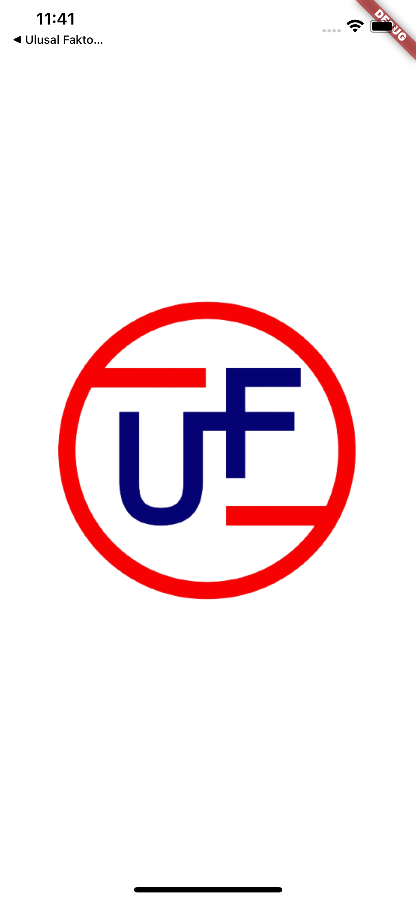
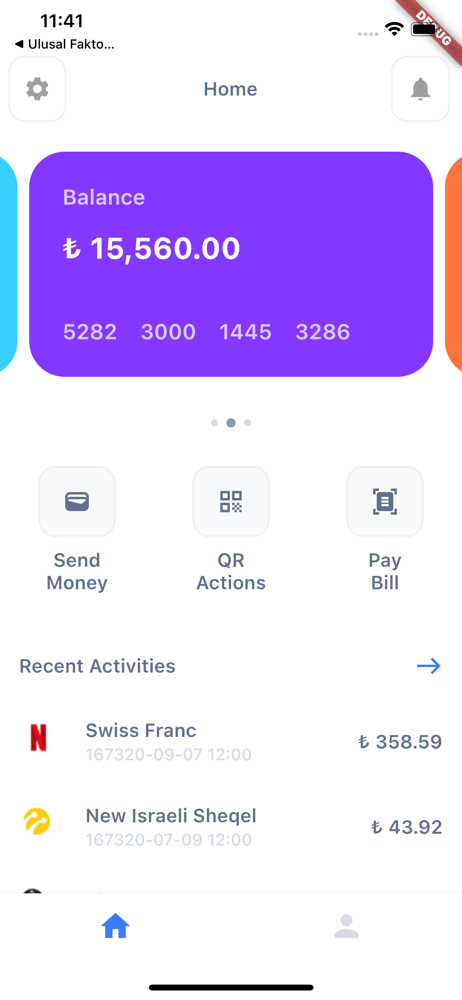
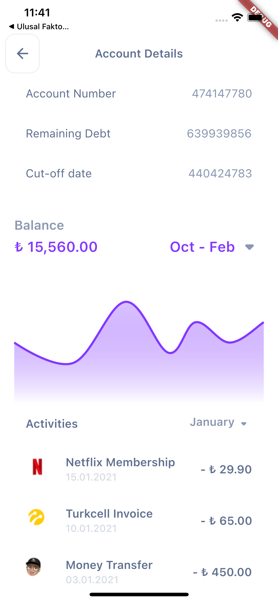
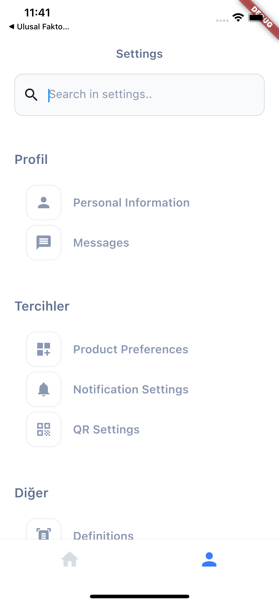

# Flutter - Mobile Case ULUSAL FAKTORING

## İlk Çalıştırma

-**Dev ortamı için**

    flutter run --target=lib/main_dev.dart --flavor=dev

-**Prod ortamı için**

    flutter run --target=lib/main_prod.dart --flavor=prod

kodlarını girerek ilk çalıştırmayı sağlayabilirsiniz.

## Ekran Görüntüleri

### Splah

### Home

### Account Detail

### Profil

## Neler Eklendi :question:

- [x] Splash
- [x] Home
- [x] Account Detail
- [x] State Management (Provider)
- [x] Flavor

## Kullanılan Paketler

 #### Utilty
 -intl,auto_size_text,kartal

 #### Widget
 -another_flushbar,smooth_page_indicator

 #### State Management
 -provider
 
#### Network
 -dio